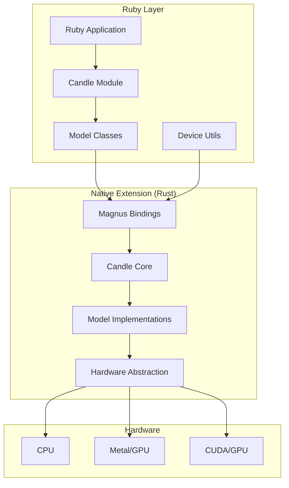
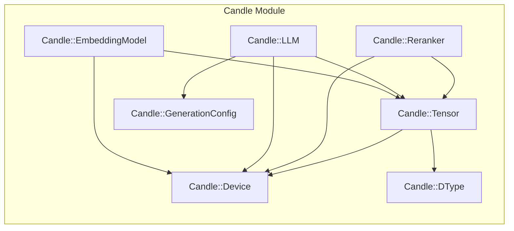
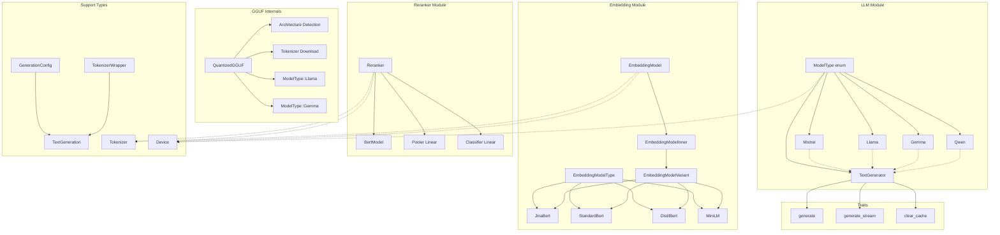
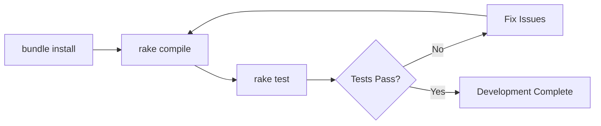
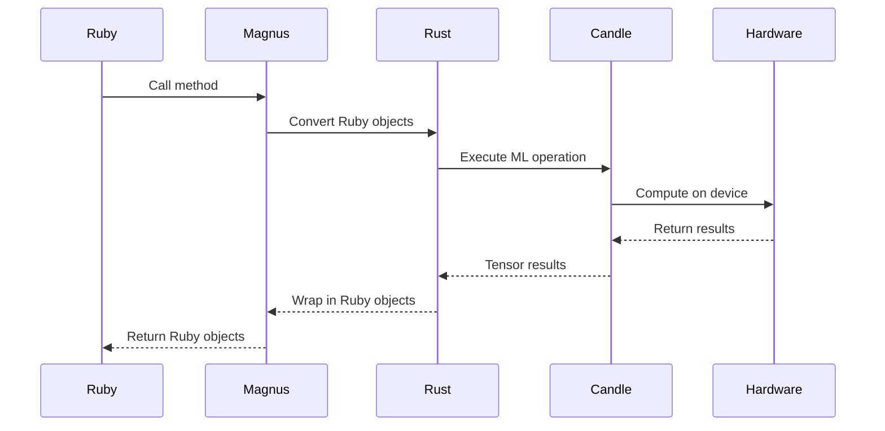

# Red Candle Development Guide

This guide captures the coding conventions and patterns used in the red-candle Ruby gem.

## Project Overview

Red Candle is a Ruby gem that uses the Magnus Rust crate to embed Rust code in Ruby, providing access to the Candle ML library from Hugging Face. It enables Ruby developers to use embedding models, rerankers, and LLMs including Llama, Mistral, Gemma, Qwen, and Phi models.

## Architecture Overview



## Module Structure

### Ruby Module Structure



### Rust Class Structure



## Directory Structure

```
red-candle/
├── lib/              # Ruby source files
│   └── candle/       # Main module namespace
├── ext/              # Native extensions
│   └── candle/       # Rust extension
│       └── src/      # Rust source files
├── spec/             # RSpec test suite
├── examples/         # Usage examples
├── docs/             # Additional documentation
└── bin/              # Executables
```

## Ruby Conventions

### Module and Class Structure

- Single module namespace: `Candle`
- Clear class responsibilities:
  - `Tensor` - Core tensor operations
  - `LLM` - Language model functionality (Llama, Mistral, Gemma, Qwen, Phi)
  - `EmbeddingModel` - Text embeddings
  - `Reranker` - Document reranking
  - `Tokenizer` - Text tokenization
  - `NER` - Named Entity Recognition

### Ruby Style

```ruby
module Candle
  class ClassName
    # Constants first
    CONSTANT_NAME = value
    
    # Class methods
    class << self
      def class_method
      end
    end
    
    # Public instance methods
    def public_method
    end
    
    private
    
    def private_method
    end
  end
end
```

### Naming Conventions

- Classes: `PascalCase`
- Methods: `snake_case`
- Constants: `UPPER_SNAKE_CASE`
- Files: `snake_case.rb`
- Use modern hash syntax with symbols
- Use keyword arguments for optional parameters

## Rust Conventions

### Rust Configuration (rustfmt.toml)

- Indentation: 4 spaces
- Line width: 100 characters max
- Edition: Rust 2021

### Rust Patterns

```rust
#[magnus::wrap(class = "Candle::ClassName", free_immediately, size)]
pub struct ClassName(pub InternalType);

impl ClassName {
    pub fn new(params: Type) -> Result<Self> {
        // Implementation with proper error wrapping
    }
}
```

- Error handling: Uses `Result<T, magnus::Error>` type
- Magnus integration: Wrapper structs with `#[magnus::wrap]`
- Feature flags: Conditional compilation for CUDA/Metal support

## Testing

### Framework: Minitest

```ruby
require_relative "test_helper"

class ClassNameTest < Minitest::Test
  def test_feature_description
    # Test implementation
  end
end
```

### Test Commands

```bash
rake              # Run default tests
rake test         # Run unit tests
rake test:device  # Run device compatibility tests
rake test:benchmark # Run benchmarks
rake test:all     # Run all tests
rake test:device:cpu/metal/cuda # Test specific device
```

## Development Workflow



## Build Commands

- **Compile**: `rake compile`
- **Test**: `rake test`
- **Lint**: Check if lint command exists in project
- **Type check**: Check if type checking is configured

## Key Patterns

1. **Error Handling**: Consistent use of Result types with proper error wrapping
2. **Device Abstraction**: Clean abstraction for CPU/Metal/CUDA devices
3. **Feature Detection**: Automatic detection of available hardware acceleration
4. **Modular Design**: Clear separation between Ruby interface and Rust implementation
5. **Testing Strategy**: Comprehensive testing with device-specific considerations
6. **Tokenizer Registry**: Automatic tokenizer detection and fallback system for GGUF models
7. **Chat Templates**: Model-specific chat template application for proper formatting

## Data Flow



## Documentation Style

- YARD documentation for Ruby code
- Rust documentation integrated
- Clear examples in code
- Markdown files for specific topics (UPPER_CASE.md for important docs)

## Important Notes

- Do not modify the 'ignored' directory
- Use frozen string literals in Ruby files
- Follow existing patterns when adding new functionality
- Ensure tests pass on all supported devices before committing
- Keep error messages informative and actionable
- Avoid adding comments unless explicitly requested

## Tokenizer Registry System

The LLM module now includes an intelligent tokenizer registry for GGUF models:

```ruby
# Register custom tokenizer mappings
Candle::LLM.register_tokenizer("model-pattern", "tokenizer-id")
Candle::LLM.register_tokenizer(/regex-pattern/, "tokenizer-id")

# Automatic detection for common models
# TheBloke/Mistral-7B-Instruct-v0.2-GGUF -> mistralai/Mistral-7B-Instruct-v0.2
```

When loading GGUF models without embedded tokenizers:
1. First attempts to load without tokenizer
2. If missing, auto-detects appropriate tokenizer source
3. Falls back with clear error messages and solutions

## GGUF Model Loading

### Syntax Options

```ruby
# Basic GGUF loading
llm = Candle::LLM.from_pretrained("TheBloke/Model-GGUF", 
                                  gguf_file: "model.Q4_K_M.gguf")

# With explicit tokenizer
llm = Candle::LLM.from_pretrained("TheBloke/Model-GGUF",
                                  gguf_file: "model.Q4_K_M.gguf",
                                  tokenizer: "original/model-source")

# Advanced syntax (used internally)
# model_id@gguf_file@@tokenizer_source
```

### Architecture Detection

The unified GGUF loader automatically detects:
- Model architecture from GGUF metadata (supports Llama, Mistral, Gemma, Qwen2/2.5)
- Appropriate tokenizer based on model patterns
- Correct chat template for the model type

Note: Qwen3 GGUF support requires candle-transformers > 0.9.1 (not yet released). Use Qwen2.5 models as an alternative.

## Chat Interface

New chat methods provide conversation-style interactions:

```ruby
messages = [
  { role: "system", content: "You are a helpful assistant." },
  { role: "user", content: "What is Ruby?" }
]

# Synchronous chat
response = llm.chat(messages)

# Streaming chat
llm.chat_stream(messages) do |token|
  print token
end
```

Model-specific templates are automatically applied:
- Llama 2: `<s>[INST] <<SYS>>...</SYS>> user [/INST] assistant </s>`
- Llama 3: `<|begin_of_text|><|start_header_id|>...<|end_header_id|>`
- Mistral: `[INST] user [/INST] assistant</s>`
- Gemma: `<start_of_turn>user...model<end_of_turn>`
- Qwen: `<|im_start|>role\ncontent<|im_end|>`

## Generation Configuration

### Presets

```ruby
# Temperature = 0, fixed seed
config = Candle::GenerationConfig.deterministic

# Higher temperature, more randomness
config = Candle::GenerationConfig.creative

# Balanced settings
config = Candle::GenerationConfig.balanced

# Chain modifications
config = Candle::GenerationConfig.balanced.with(max_length: 1000)
```

### Debug Mode

```ruby
# Shows token IDs and pieces during generation
config = Candle::GenerationConfig.new(debug_tokens: true)
llm.generate("Hello", config: config)
# Output: [128000:Hello][1299: world][128001:<|eot_id|>]
```

## Error Handling Improvements

Enhanced error messages now provide:
- Specific failure reasons
- Multiple solution suggestions
- Network connectivity hints
- Authentication guidance (HF_TOKEN)
- Alternative model/tokenizer recommendations

Example error output:
```
Failed to load GGUF model with auto-detected tokenizer.

Original error: No tokenizer found in GGUF repository
Tokenizer error: Failed to find tokenizer in specified source

Possible solutions:
1. Specify a tokenizer explicitly
2. Check your network connection
3. Set HF_TOKEN environment variable
4. Try a different model source
```

## Tokenizer API

The tokenizer functionality is now exposed to Ruby for direct use:

### Standalone Tokenizer Usage

```ruby
# Load from HuggingFace
tokenizer = Candle::Tokenizer.from_pretrained("bert-base-uncased")

# Load from local file
tokenizer = Candle::Tokenizer.from_file("/path/to/tokenizer.json")

# Encode text to IDs
tokens = tokenizer.encode("Hello, world!")
tokens = tokenizer.encode("Hello", add_special_tokens: false)

# Encode text to token strings (useful for visualization)
token_strings = tokenizer.encode_to_tokens("Hello, world!")
# => ["[CLS]", "hello", ",", "world", "!", "[SEP]"]

# Get both IDs and tokens together
result = tokenizer.encode_with_tokens("Hello, world!")
# => {"ids" => [101, 7592, 1010, 2088, 999, 102], 
#     "tokens" => ["[CLS]", "hello", ",", "world", "!", "[SEP]"]}

# Batch encoding
batch = tokenizer.encode_batch(["Hello", "World"])
batch_tokens = tokenizer.encode_batch_to_tokens(["Hello", "World"])

# Decode tokens
text = tokenizer.decode([101, 7592, 102])
text = tokenizer.decode(tokens, skip_special_tokens: false)

# Vocabulary operations
vocab_size = tokenizer.vocab_size
vocab = tokenizer.get_vocab  # Returns Hash of token => id
token_str = tokenizer.id_to_token(101)  # "[CLS]"

# Configuration
padded = tokenizer.with_padding(length: 128)
truncated = tokenizer.with_truncation(512)
```

### Model Tokenizer Access

All model types now expose their tokenizers:

```ruby
# From LLM
llm_tokenizer = llm.tokenizer

# From EmbeddingModel
emb_tokenizer = embedding_model.tokenizer

# From Reranker
rank_tokenizer = reranker.tokenizer
```

### Use Cases

- **Token Analysis**: Inspect how text is tokenized with `encode_to_tokens`
- **Visualization**: See exactly which subwords are created from input text
- **Preprocessing**: Custom tokenization for specific tasks
- **NER Preparation**: Token-level named entity recognition with aligned tokens
- **Debugging**: Understand model tokenization behavior with token strings
- **Custom Pipelines**: Build specialized text processing
- **Education**: Teach how modern tokenizers handle text

## Named Entity Recognition (NER)

Red Candle now supports Named Entity Recognition for extracting entities from text:

### Model-based NER

```ruby
# Load pre-trained NER model
ner = Candle::NER.from_pretrained("Babelscape/wikineural-multilingual-ner")

# Extract entities
entities = ner.extract_entities("Apple Inc. was founded by Steve Jobs.")
# => [
#   { "text" => "Apple Inc.", "label" => "ORG", "start" => 0, "end" => 10, "confidence" => 0.99 },
#   { "text" => "Steve Jobs", "label" => "PER", "start" => 26, "end" => 36, "confidence" => 0.98 }
# ]

# Get token-level predictions
tokens = ner.predict_tokens("John works at Google")
```

### Pattern & Gazetteer Recognition

For specialized domains, combine patterns and dictionaries:

```ruby
# Pattern-based (e.g., for genes)
gene_recognizer = Candle::PatternEntityRecognizer.new("GENE", [
  /\b[A-Z][A-Z0-9]{2,}\b/,  # TP53, BRCA1
  /\bCD\d+\b/               # CD4, CD8
])

# Dictionary-based
drug_recognizer = Candle::GazetteerEntityRecognizer.new("DRUG", 
  ["aspirin", "ibuprofen", "metformin"])

# Hybrid approach
hybrid = Candle::HybridNER.new("Babelscape/wikineural-multilingual-ner")
hybrid.add_pattern_recognizer("GENE", gene_patterns)
hybrid.add_gazetteer_recognizer("DRUG", drug_list)
```

### Custom Entity Types

Perfect for specialized fields:
- **Biomedical**: Genes, proteins, drugs, diseases
- **Finance**: Tickers, currencies, companies
- **Legal**: Cases, statutes, parties
- **Technical**: Error codes, APIs, components

## Recent Updates

- Implemented comprehensive Named Entity Recognition (NER) system
- Added pattern-based and gazetteer-based entity recognizers
- Created hybrid NER combining ML models with rule-based approaches
- Unified tokenizer implementation across all model types
- Exposed tokenizer API to Ruby with token string functionality
- Added tokenizer access methods to LLM, EmbeddingModel, and Reranker
- Created standardized padding and truncation configurations
- Improved error messages with specific solutions
- Removed deprecated Rb-prefixed class names